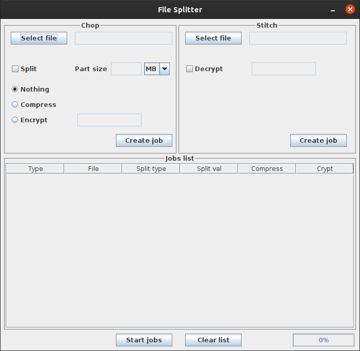

# `File-Splitter`

A simple tool to split, zip, and encrypt files

## Specification

#### Written in Java 8, can be run on all the operating systems
Need Java virtual machine to start, available [**here**](https://www.java.com/en/download/)

- Split by size
- Compress files using .zip format
- Encrypt files using Advanced Encryption Standard (AES) 128 bit (***16-digit password to encrypt***)
- Place multiple files in a queue before processing them

**temporary files are automatically deleted**

**the output files will be stored in the File Splitter current folder**

## Documentation
The documentation for this project is available in the **/doc** folder

## Screenshot
Swing GUI, *the graphic could change between operating systems*

