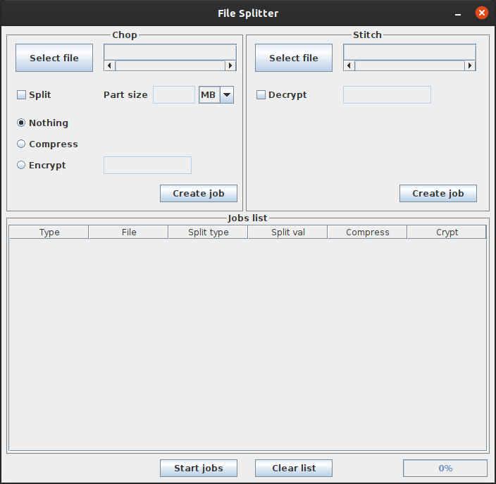

# `File-Splitter` 

A simple tool for split, zip, and encrypt a file

## Specification

#### Written in Java 8, can be run on all the operating systems

- Split by size
- Compress files using .zip format
- Encrypt files using Advanced Encryption Standard (AES) 128 bit (***16-digit password to encrypt***)

## Documentation
The documentation for this project is available in **doc** folder

## Screenshot

